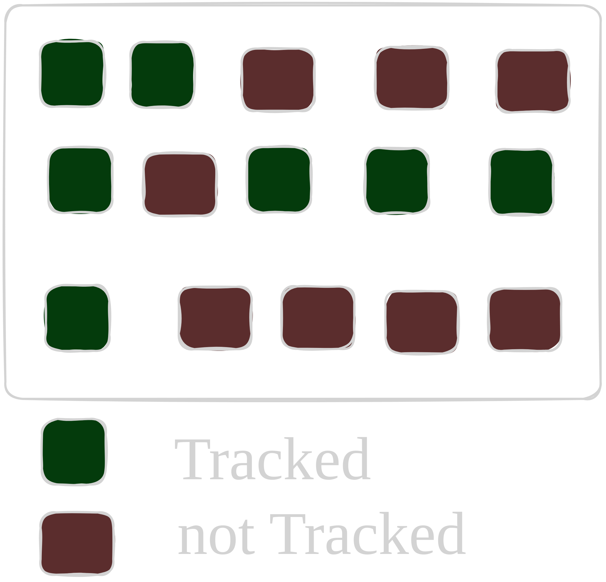
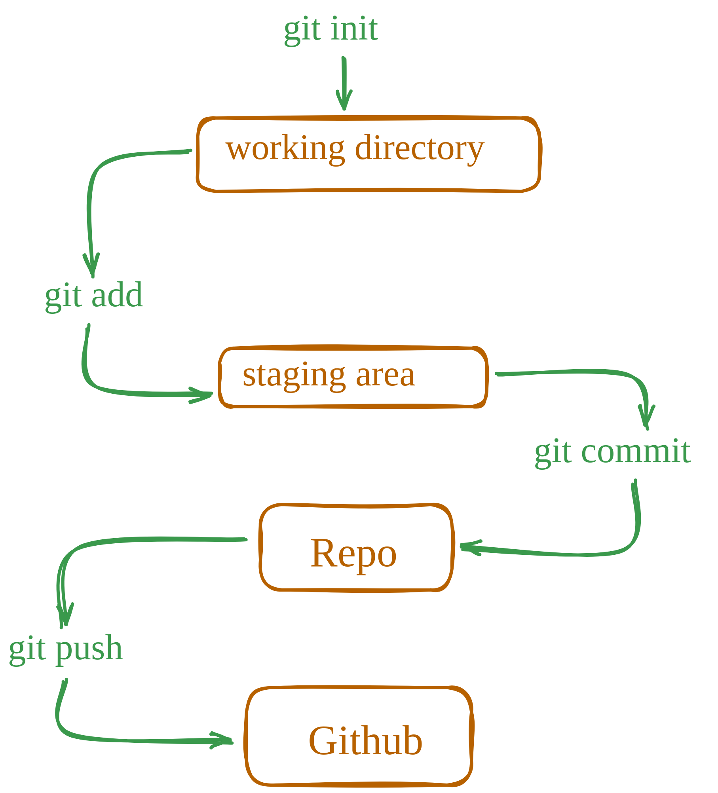

# Terminology

### Git and Github are different

**Git** is a version control system that is used to track changes to your files. It is a free and open-source software that is available for Windows, macOS, and Linux. Remember, GIT is a software and can be installed on your computer.

**Github** is a web-based hosting service for Git repositories. Github is an online platform that allows you to store and share your code with others. It is a popular platform for developers to collaborate on projects and to share code. It is not that Github is the only provider of Git repositories, but it is one of the most popular ones.

#

### A little on version control systems

Version control systems are used to manage the history of your code. They allow you to track changes to your files and to collaborate with others. Version control systems are essential for software development. Consider version control as a checkpoint in game. You can move to any time in the game and you can always go back to the previous checkpoint. This is the same concept in software development.

Before Git became mainstream, version control systems were used by developers to manage their code. They were called SCCS (Source Code Control System). SCCS was a proprietary software that was used to manage the history of code. It was expensive and not very user-friendly. Git was created to replace SCCS and to make version control more accessible and user-friendly. Some commong version control systems are Subversion (SVN), CVS, and Perforce.

#

### Check your git version

To check your git version, you can run the following command:

`git --version`

This command will display the version of git installed on your system. Git is a very stable software and don’t get any breaking changes in majority of the cases, at least in my experience.

#

### Repository

A repository is a collection of files and directories that are stored together. It is a way to store and manage your code. A repository is like a folder on your computer, but it is more than just a folder. It can contain other files, folders, and even other repositories. You can think of a repository as a container that holds all your code.

There is a difference between a software on your system vs tracking a particular folder on your system. At any point you can run the following command to see the current state of your repository:

`git status`

Not all folders are meant to be tracked by git. Here we can see that all green folders are projects are getting tracked by git but red ones are not.

#

### Your config settings

Github has a lot of settings that you can change. You can change your username, email, and other settings. Whenever you checkpoint your changes, git will add some information about your such as your username and email to the commit. There is a git config file that stores all the settings that you have changed. You can make settings like what editor you would like to use etc. There are some global settings and some repository specific settings.

Let’s setup your email and username in this config file. I would recommend you to create an account on github and then use the email and username that you have created.

`git config --global user.email "your-email@example.com"`

`git config --global user.name "Your Name"`

Now you can check your config settings:

`git config --list`

This will show you all the settings that you have changed.

#

### Creating a repository

Creating a repository is a process of creating a new folder on your system and initializing it as a git repository. It’s just regular folder to code your project, you are just asking git to track it. To create a repository, you can use the following command:

`git status`

`git init`

`git status` command will show you the current state of your repository. `git init` command will create a new folder on your system and initialize it as a git repository. This adds a hidden `.git` folder to your project.

_**NOTE**: Using 'master' as the name for the initial branch. This default branch name is subject to change. Names commonly chosen instead of `master` are `main`, `trunk` and `development`._

`git config --global init.defaultBranch <name>` .

`git branch -m <name>`

#

### Complete git flow

A complete git flow, along with pushing the code to github looks like this:

When you want to track a new folder, you first use `init` command to create a new repository. Then you can use add command to `add` the folder to the repository. After that you can use `commit` command to save the changes. Finally you can use `push` command to push the changes to github. Of course there is more to it but this is the basic flow.

#

### Stage

Stage is a way to tell git to track a particular file or folder. You can use the following command to stage a file:

`git add <file> <file2>`

`git status`

Here we are initializing the repository and adding a file to the repository. Then we can see that the file is now being tracked by git. Currently our files are in staging area, this means that we have not yet committed the changes but are ready to be committed.

#

### Unstage

Unstaging a file removes it from the staging area without deleting it from your working directory. To unstage a file and stop Git from tracking it for the next commit while keeping the file intact locally, you can use the following command:

`git rm --cached <file>...`

If you want to unstage changes that were added to the staging area using `git add`, but still keep the file tracked by Git, you can use:

`git restore --staged <file>...`

This command reverts the file back to its previous state in the repository without affecting the working directory, allowing your changes to appear as unstaged in `git status`.

### Key Differences

| Command                | Unstages Changes? | Stops Tracking the File? | Deletes File from Disk? |
| ---------------------- | ----------------- | ------------------------ | ----------------------- |
| `git restore --staged` | Yes               | No                       | No                      |
| `git rm --cached`      | Yes               | Yes                      | No                      |

#

### Commit

`git commit -m "commit message"`

`git status`

Here we are committing the changes to the repository. We can see that the changes are now committed to the repository. The `-m` flag is used to add a message to the commit. This message is a short description of the changes that were made. You can use this message to remember what the changes were. Missing the `-m` flag will result in an action that opens your default settings editor, which is usually VIM. We will change this to vscode in the next section.

#

### Logs

`git log`

This command will show you the history of your repository. It will show you all the commits that were made to the repository. You can use the `--oneline` flag to show only the commit message. This will make the output more compact and easier to read.

_Atomic commits are a way to make sure that each commit is a self-contained unit of work. This means that if one commit fails, you can always go back to a previous commit and fix the issue. This is important for maintaining a clean and organized history in your repository._

#

### gitignore

`.gitignore` is a file that tells git which files and folders to ignore. It is a way to prevent git from tracking certain files or folders. You can create a `.gitignore` file and add list of files and folders to ignore by using the following command:

Example:
`node_modules`
`.env`
`.vscode`
`.DS_Store`

Now, when you run the git status command, it will not show the node_modules and .vscode folders as being tracked by git.
