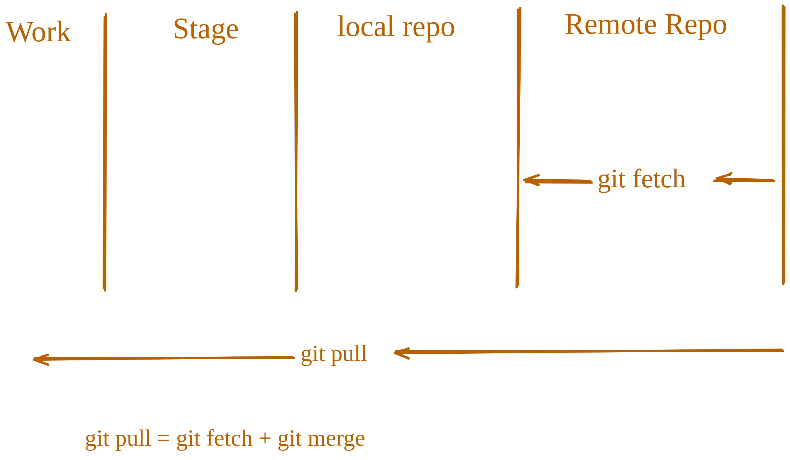

# getting started with Github

### What is Github?

Github is a web-based Git repository hosting service. It is a popular platform for developers to collaborate on projects and to share code. Github provides a user-friendly interface for managing and tracking changes to your code, as well as a platform for hosting and sharing your projects with others.

Some other alternative of Github are:

- Gitlab
- Bitbucket
- Azure Repos
- Gitea

But mainstream popular tool these days is Github.

#

### Github Account

Creating a Github account is free and easy. You can create an account by visiting the [Github](https://github.com/) website and clicking on the “Sign up” button. You will be prompted to enter your email address and password, and then you will be redirected to the Github homepage.

Once you have created an account, you can start using Github to host and collaborate on your projects. Github provides a variety of features and tools that make it easy to manage and track your code, including issues, pull requests, and code reviews.

#

### Configure your config file

If you havn’t done it already, you need to configure your git config file. You can do this by running the following command:

`git config --global user.email "your-email@example.com"`

`git config --global user.name "Your Name"`

This will set your email and name as your global settings.

Now you can check your config settings:

`git config --list`

This will show you all the settings that you have changed.

#

### Adding code to remote repository

Now that you have setup your ssh key and added it to your github account, you can start pushing your code to the remote repository.

Create a new Repo on your system first, add some code and commit it.

`git init`

`git add <files>`

`git commit -m "commit message"`

#

### Check remote url setting

You can check the remote url setting by running the following command:

`git remote -v`

This will show you the remote url of your repository.

#

### Add remote repository

You can add a remote repository by running the following command:

`git remote add origin <remote-url>`

Here `<remote-url>` is the url of the remote repository that you want to add and origin is the name of the remote repository. This origin is used to refer to the remote repository in the future.

git remote add origin https://github.com/kumarsgoyal/git.git

#

### Push code to remote repository

`git push remote-name branch-name`

Here `remote-name` is the name of the remote repository that you want to push to and branch-name is the name of the branch that you want to push.

`git push origin main`

_The command `git branch -m main` is used to rename the current branch to main. This is especially useful when your local branch is named master, but the remote repository uses main as the default branch name._

### Setup an upstream remote

Setting up an upstream remote is useful when you want to keep your local repository up to date with the remote repository. It allows you to fetch and merge changes from the remote repository into your local repository.

To set up an upstream remote, you can use the following command:

`git remote add upstream <remote-url>`

or you can use shorthand:

`git remote add -u <remote-url>`

You can do this at the time of pushing your code to the remote repository.

`git push -u origin main`

This will set up an upstream remote and push your code to the remote repository.

This will allow you to run future commands like git pull and git push without specifying the remote name.

#

### Get code from remote repository

There are two ways to get code from a remote repository:

- fetch the code
- pull the code

Fetch the code means that you are going to download the code from the remote repository to your local repository. Pull the code means that you are going to download the code from the remote repository and merge it with your local repository.

#

### Fetch code

To fetch code from a remote repository, you can use the following command:

`git fetch <remote-name>`

Here `<remote-name>` is the name of the remote repository that you want to fetch from.

#

### Pull code

To pull code from a remote repository, you can use the following command:

`git pull <remote-name> <branch-name>`

`git pull origin main`

Here `<remote-name>` is the name of the remote repository that you want to pull from and `<branch-name>` is the name of the branch that you want to pull.
